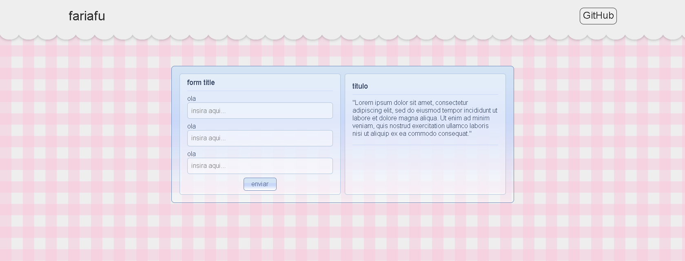
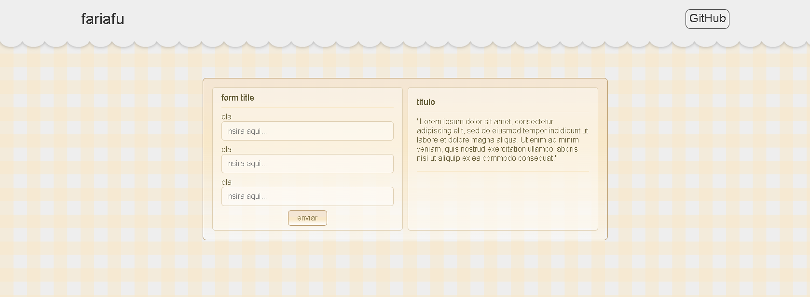
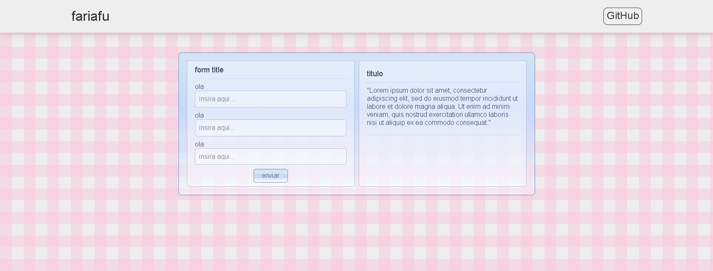

# Temas e utilidades CSS

Conjunto de temas e classes de utilidade CSS, inspirados no Windows Vista. Mais exemplos estao disponiveis na pasta README.

---

tema sky, background cherry

 

tema waffle, background waffle

 

sem renda na barra de navegacao

